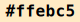
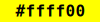
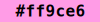
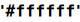
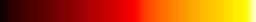
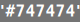
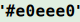

chroma.ts
=========

TypeScript rewrite of [chroma-js](https://github.com/gka/chroma.js). Includes:

*   Proper ES module support.
*   Included typings generated from the source.
*   A number of bugfixes.
*   No more `NaN` values.
*   Exceptions on invalid inputs.
*   Better inline documentation.
*   Smaller (10.46 KB gzipped).

Installation
------------

```
npm install --save chroma.ts
```

Usage
-----

```ts
// in TypeScript / using ES modules
import chroma from 'chroma.ts'

// commonjs
const chroma = require('chroma.ts').default

chroma.css('powderblue') // create a color
    .darker(2) // transform it
    .gl() // output it
```

Alternatively, you can include the [UMD bundle](./dist/index.umd.js) in a script tag and use the `chroma` global.

API
---

### _namespace_ `chroma`

### `chroma`(_red255_: number, _green255_: number, _blue255_: number, _alpha1_: number = 1): [Color](#Color) <sub><a href="src/index.ts#L92">src</a></sub>

_example_ `chroma(99, 99, 44, 0.7)`   

### `chroma`(_x_: [chroma.Chromable](#chroma.Chromable), _format_?: [ColorFormat](#ColorFormat)): [Color](#Color) <sub><a href="src/index.ts#L99">src</a></sub>

_example_ `chroma('mediumorchid') // a css string`   
_example_ `chroma([56, 203, 30]) // a RGB triple`   
_example_ `chroma(0x4b0082) // a hex num`   
_example_ `chroma([30, 0.8, 0.3], 'hsl') // explicit format`   

### `chroma`(_colorname_: typeof \[object Object\], _format_?: undefined | `"name"`): [Color](#Color) <sub><a href="src/index.ts#L103">src</a></sub>

This overload allows VS Code to suggest color names when you type `chroma('`.

### `chroma`(_channel0_: number, _channel1_: [Color](#Color), _channel2_: number, _format_: [ColorFormat](#ColorFormat)): [Color](#Color) <sub><a href="src/index.ts#L105">src</a></sub>

_example_ `chroma(30, 0.8, 0.3, 'hsl')`   

### `chroma`(_channel0_: number, _channel1_: [Color](#Color), _channel2_: number, _channel3_: number, _format_: [ColorFormat](#ColorFormat)): [Color](#Color) <sub><a href="src/index.ts#L107">src</a></sub>

_example_ `chroma(0.3, 0.8, 0.3, 1, 'gl')`   

### _type_ `Chromable` = number | string | [Color](#Color) | number\[\]

A Chromable is any value which can be converted to a color. For ease of use, most functions accept these instead of only Color values.

### _interface_ `Color`

### `color.mix`(_col2_: [Chromable](#Chromable), _f_: number, _m_: [InterpolationMode](#InterpolationMode) = "rgb"): [Color](#Color) <sub><a href="src/index.ts#L212">src</a></sub>

@see \[\[chroma.mix\]\]

### `color.rgb`(_doRound_: boolean = true, _clamp\__: boolean = true): [RGB](#RGB) <sub><a href="src/index.ts#L215">src</a></sub>

### `color.rgba`(_doRound_: boolean = true, _clamp\__: boolean = true): [RGBA](#RGBA) <sub><a href="src/index.ts#L224">src</a></sub>

### `color.hex`(_mode_: `"rgb"` | `"rgba"` | `"argb"` = "rgb"): string <sub><a href="src/index.ts#L243">src</a></sub>

Return a hex-string representation of this color.

@see #num for a hex-number representation.

_example_ `chroma('yellow').alpha(0.7).hex()` `"#ffff00"`  
_example_ `chroma('yellow').alpha(0.7).hex('rgba')` `"#ffff00b3"`  
_example_ `chroma('yellow').alpha(0.7).hex('argb')` `"#b3ffff00"`  

### `color.hsl`(): [HSL](#HSL) <sub><a href="src/index.ts#L253">src</a></sub>

Returns the HSL representation of this color. hue will always be in \[0;360). Values are never NaN.

_example_ `chroma('purple').hsl()` \[300, 1, ~0.25\]  

### `color.hsv`(): Object <sub><a href="src/index.ts#L263">src</a></sub>

Returns the HSL representation of this color. hue will always be in \[0;360). Values are never NaN.

_example_ `chroma('purple').hsv()` \[300, 1, ~0.5\]  

### `color.hcg`(): Object <sub><a href="src/index.ts#L273">src</a></sub>

Returns the HSL representation of this color. hue will always be in \[0;360). Values are never NaN.

_example_ `chroma('purple').hcg()` \[300, ~0.5, 0\]  

### `color.css`(_mode_: `"rgb"` | `"hsl"` = "rgb"): string <sub><a href="src/index.ts#L285">src</a></sub>

Returns a CSS `rgb(...)` or `hsl(...)` string representation that can be used as CSS-color definition. The alpha value is not output if it 1.

_example_ `chroma('teal').css()` `"rgb(0,128,128)"`  
_example_ `chroma('teal').alpha(0.5).css()` `"rgba(0,128,128,0.5)"`  
_example_ `chroma('teal').css('hsl')` `"hsl(180,100%,25.1%)"`  

### `color.name`(_closest_: true): string <sub><a href="src/index.ts#L296">src</a></sub>

### `color.name`(_closest_: false | true = false): string | undefined <sub><a href="src/index.ts#L308">src</a></sub>

Get the name of a color. By default, this method will try to match the color exactly (comparing rounded RGB values). Pass `true` to return the name of the color which is closest to `this` in CIELAB color space. CIELAB is used as it is perceptually uniform.

_example_ `chroma('#ff0000').name()` `"red"`  
_example_ `chroma('#ff0001').name()`  
_example_ `chroma('#ff0001').name(true)` `"red"`  

### `color.cmyk`(): Object <sub><a href="src/index.ts#L327">src</a></sub>

Get the [CMYK](#chroma.CMYK) representation of this color.

_example_ `chroma('red').cmyk()` \[0, 1, 1, 0\]  

### `color.gl`(): [GL](#GL) <sub><a href="src/index.ts#L336">src</a></sub>

Returns the GL representation of this color.

_example_ `chroma('33cc00').gl()` \[0.2, 0.8, 0, 1\]  

### `color.luminance`(): number <sub><a href="src/index.ts#L348">src</a></sub>

Get luminance of the color. This is equal to the Y channel of the XYZ color space.

_example_ `chroma('black').luminance()` `0`  
_example_ `chroma('white').luminance()` `~1`  
_example_ `chroma('red').luminance()` `~0.21`  

@see https://en.wikipedia.org/wiki/Relative\_luminance

### `color.luminance`(_lum1_: number): this <sub><a href="src/index.ts#L357">src</a></sub>

Return a new Color with `lum1` by linearly interpolating `this` with white (when increasing the luminance) or black (otherwise) in the XYZ color space.

@see https://en.wikipedia.org/wiki/Relative\_luminance

_example_ `// Approximately doubling the luminance of red`  
_example_ `chroma('red').luminance(0.4) // "Vivid Tangerine"`   

### `color.temperature`(): number <sub><a href="src/index.ts#L382">src</a></sub>

Get color temperature of this color in Kelvin. This only makes sense for colors close to those output by chroma.kelvin

_example_ `[c = chroma('#ff3300'), c.temperature()]` \[, 943\]  
_example_ `[c = chroma('#ffe3cd'), c.temperature()]` \[, 4998\]  
_example_ `[c = chroma('#b3ccff'), c.temperature()]` \[, 15169\]  

### `color.set`(_modeAndChannel_: string, _value_: number | ((_channel_: number) => number)): [Color](#Color) <sub><a href="src/index.ts#L394">src</a></sub>

Returns a new Color with a channel changed.

_example_ `chroma('skyblue').set('hsl.h', 0) // change hue to 0 deg (=red)`   
_example_ `chroma('hotpink').set('lch.c', 30) // set chromaticity to 30`   
_example_ `chroma('orangered').set('lab.l', x => x / 2) // half Lab lightness`   
_example_ `chroma('darkseagreen').set('lch.c', x => x * 2) // double Lch saturation`   

### `color.clipped`(): boolean <sub><a href="src/index.ts#L412">src</a></sub>

Returns whether this color is outside the RGB color cube and will be clipped/clamped when calling .rgb()

_example_ `[c = chroma.lch( 20, 40, 50), c.clipped()]` \[, true\]  
_example_ `[c = chroma.lch( 40, 40, 50), c.clipped()]` \[, false\]  
_example_ `[c = chroma.lch( 60, 40, 50), c.clipped()]` \[, false\]  
_example_ `[c = chroma.lch( 80, 40, 50), c.clipped()]` \[, true\]  
_example_ `[c = chroma.lch(100, 40, 50), c.clipped()]` \[, true\]  

### `color.textColor`(): [Color](#Color) <sub><a href="src/index.ts#L424">src</a></sub>

Returns black or white, whichever has the highest contrast to `this`. In the readme you should see the result of this.

_example_ `chroma('red')`   
_example_ `chroma('yellow')`   

### `color.alpha`(): number <sub><a href="src/index.ts#L432">src</a></sub>

Get alpha value of color.

_example_ `chroma.rgb(0, 0, 255, 0.5).alpha()` `0.5`  

### `color.alpha`(_alpha1_: number): [Color](#Color) <sub><a href="src/index.ts#L439">src</a></sub>

Return new Color with given alpha value.

_example_ `chroma('green').alpha(0.3)`   
_example_ `chroma('green').alpha(0.3).hex('rgba')` `"#0080004d"`  

### `color.darker`(_amount_: number = 1): [Color](#Color) <sub><a href="src/index.ts#L448">src</a></sub>

### `color.brighter`(_amount_: number = 1): [Color](#Color) <sub><a href="src/index.ts#L461">src</a></sub>

_example_ `chroma('hotpink')`   
_example_ `chroma('hotpink').brighter()`   
_example_ `chroma('hotpink').brighter(2)`   
_example_ `chroma('hotpink').brighter(3)`   

### `color.saturate`(_amount_: number = 1): [Color](#Color) <sub><a href="src/index.ts#L473">src</a></sub>

Returns a new Color with increased saturation.

_example_ `chroma('slategray')`   
_example_ `chroma('slategray').saturate()`   
_example_ `chroma('slategray').saturate(2)`   
_example_ `chroma('slategray').saturate(3)`   

### `color.desaturate`(_amount_: number = 1): [Color](#Color) <sub><a href="src/index.ts#L482">src</a></sub>

Equivalent to `saturate(-amount)`.

@see #saturate

### `color.premultiplied`(): [Color](#Color) <sub><a href="src/index.ts#L486">src</a></sub>

### `color.hsi`(): Object <sub><a href="src/index.ts#L496">src</a></sub>

Returns the HSI representation of this color. hue will always be in \[0; 360). Values are never NaN.

_example_ `chroma('purple').hsi()` \[300, 1, ~0.33\]  

### `color.lab`(): Object <sub><a href="src/index.ts#L506">src</a></sub>

Returns the LAB representation of this color.

_example_ `chroma('purple').lab()` \[~29.78, ~58.93, ~-36.49\]  

### `color.num`(_mode_: `"rgb"` | `"rgba"` | `"argb"` = "rgb"): number <sub><a href="src/index.ts#L520">src</a></sub>

Return a hex-num of this color.

@see #num for a hex-number representation.

_example_ `chroma('yellow').alpha(0.7).hex()` `"#ffff00"`  
_example_ `chroma('yellow').alpha(0.7).hex('rgba')` `"#ffff00b3"`  
_example_ `chroma('yellow').alpha(0.7).hex('argb')` `"#b3ffff00"`  

### `color.lch`(): Object <sub><a href="src/index.ts#L530">src</a></sub>

Returns the LCH representation of this color. hue will always be in \[0; 360). Values are never NaN.

_example_ `chroma('purple').lch()` \[~29.78, ~69.31, ~328.23\]  

### `color.xyz`(): Object <sub><a href="src/index.ts#L540">src</a></sub>

Returns the XYZ representation of this color. hue will always be in \[0; 360). Values are never NaN.

_example_ `chroma('purple').xyz()` \[~0.13, ~0.06, ~0.21\]  

### `color.equals`(_color_: [Color](#Color)): boolean <sub><a href="src/index.ts#L548">src</a></sub>

Whether this [Color](#chroma.Color) is identical (strict equality of r, g, b, a) to `color`.

### `color.hashCode`(): number <sub><a href="src/index.ts#L554">src</a></sub>

### `color.toSource`(): string <sub><a href="src/index.ts#L562">src</a></sub>

_example_ `chroma('red').toSource()` `"chroma.rgb(255, 0, 0)"`  
_example_ `chroma.rgb(-2, 100.02, 200, 0.5).toSource()` `"chroma.rgb(-2, 100.02, 200, 0.5)"`  

### `color.toString`(): string <sub><a href="src/index.ts#L568">src</a></sub>

### `color.kelvin`(): number <sub><a href="src/index.ts#L571">src</a></sub>

### _namespace_ `black`

_example_ `chroma.black`   

### _namespace_ `white`

_example_ `chroma.black`   

### `chroma.cubehelix`(_start_: number = 300, _rotations_: number = -1.5, _hue_: number | \[number, number\] = 1, _gamma_: number = 1, _lightness_: number | \[number, number\] = \[0, 1\]): [CubeHelix](#CubeHelix) <sub><a href="src/index.ts#L928">src</a></sub>

Return a new \[CubeHelix\].

_example_ `chroma.cubehelix() // use the default helix` [](http://localhost:10002/spaces/index.html#chroma.cubehelix()%20//%20use%20the%20default%20helix-0000000401040803080c050d0f0612120817140b1c160d2118102719122c1a15301a19351b1c3a1a203e1a24411a2845192c4818304a17354c16394d163e4e15424e15474e154b4e15504d16544c17584a185c481a60461d6343206741236a3e276d3c2b6f393072373674353c753342773149783050792f577a2f5e7a2f667a306e7b31767b337e7a36867a398e7a3d957a419c7946a3794caa7952b07959b67960bc7967c17a6fc57a77c97b7fcc7c87cf7e8fd17f98d381a0d484a8d486b0d589b8d48cbfd490c6d393ccd197d3d09bd8ce9fddcda4e2cba8e6c9ade9c7b2ecc6b6efc4bbf0c3c0f2c2c5f3c2c9f3c1cef3c1d2f3c2d6f3c3daf2c4def2c6e1f1c9e5f0cbe8f0ceebefd2edefd6f0efdaf2efdef4efe3f6f0e7f8f2ecf9f3f1fbf6f6fcf8fafefbffffff)  
_example_ `chroma.cubehelix().start(200).rotations(-0.5).gamma(0.8).lightness([0.3, 0.8])` [](http://localhost:10002/spaces/index.html#chroma.cubehelix().start(200).rotations(-0.5).gamma(0.8).lightness(%5B0.3,%200.8%5D)%0A-3b6c8f3b6e8f3b718f3b738f3b75903b77903b79903c7b8f3c7d8f3c7f8f3c828f3d848e3d868e3e888e3e898d3f8b8d3f8d8c408f8c41918b42938a42958a439689449888469a87479b87489d86499f854ba0844ca2844da3834fa48250a68152a78054a88056aa7f57ab7e59ac7e5bad7d5dae7c5faf7c62b07b64b17b66b27a68b37a6ab4796db5796fb67972b77874b77877b87879b9787cba787eba7881bb7884bb7886bc7889bd798cbd798ebe7991be7a94be7a97bf7b99bf7b9cc07c9fc07da1c07ea4c17fa7c180aac181acc282afc283b2c284b4c386b7c387b9c388bcc48abec48cc1c48dc3c58fc6c591c8c592cac694cdc696cfc798d1c79ad3c79cd5c89ed7c8a0d9c9a2dbc9a4ddcaa6dfcaa9e1cbabe2cbade4ccafe6ccb2e7cdb4e9ceb6eaceb9ebcfbb)  

### _interface_ `CubeHelix`

[Dave Green's cubehelix color scheme](http://www.mrao.cam.ac.uk/~dag/CUBEHELIX/)!

A CubeHelix is a function defined on 0, 1 which returns colors.

### `cubehelix`(_f_: number): [Color](#Color) <sub><a href="src/index.ts#L952">src</a></sub>

[Dave Green's cubehelix color scheme](http://www.mrao.cam.ac.uk/~dag/CUBEHELIX/)!

A CubeHelix is a function defined on 0, 1 which returns colors.

### `cubehelix.start`(_s_: number): number | this <sub><a href="src/index.ts#L961">src</a></sub>

### `cubehelix.rotations`(_r_: number): number | this <sub><a href="src/index.ts#L968">src</a></sub>

### `cubehelix.gamma`(_g_: number): number | this <sub><a href="src/index.ts#L975">src</a></sub>

### `cubehelix.hue`(_h_: number | \[number, number\]): Object | this <sub><a href="src/index.ts#L982">src</a></sub>

### `cubehelix.lightness`(_h_: number | \[number, number\]): Object | this <sub><a href="src/index.ts#L989">src</a></sub>

### `cubehelix.scale`(): [Scale](#Scale) <sub><a href="src/index.ts#L1002">src</a></sub>

Convert to a \[Scale\].

_example_ `chroma.cubehelix().scale().correctLightness().domain(2, 22)` [](http://localhost:10002/spaces/index.html#chroma.cubehelix().scale().correctLightness().domain(2,%2022)%0A-0100010703070d050e100714140a1a160c20180f2619112a1a142e1a16321a19351b1a371b1d3a1a203d1a23401a26431a2744192a47182e49182f4918334b17364c17384d163c4e163d4e15414e15444f15464e154a4e154d4e154f4d16524c16554b17594a185c481a5f461b61451d64431f674122693f276d3c2a6f3a2f71373674353d763247783051792f5d7a2f697b30757b337e7a368a7a3b967a429f7948a7794fae7956b77961bd7969c37a73c87b7ccc7c85cf7e8fd18099d382a2d485acd588b5d48cbdd48fc6d392cbd297d2d09bd8cf9fdccda4e2cba7e5c9ade9c8b0ebc6b6eec5b9f0c4bdf1c3c1f2c2c6f3c2c9f3c1cdf3c1d2f3c2d5f3c3daf2c4ddf2c6e1f1c8e4f1cbe7f0ceebefd1edefd5f0efdaf2efe1f5f0e6f7f1ecf9f3f3fcf7f9fdfafefffe)  

### `cubehelix.at`(_fract_: number): [Color](#Color) <sub><a href="src/index.ts#L1006">src</a></sub>

### `chroma.random`(_randomSource_: [random](#random) = Math.random): [Color](#Color) <sub><a href="src/index.ts#L1025">src</a></sub>

Create a new random Color from a random point in the RGB color space.

### `chroma.mix`(_col1_: [Chromable](#Chromable), _col2_: [Chromable](#Chromable), _f_: number = 0.5, _m_: [InterpolationMode](#InterpolationMode) = "rgb"): [Color](#Color) <sub><a href="src/index.ts#L1078">src</a></sub>

Mixes two colors. The mix ratio is a value between 0 and 1. The color mixing produces different results based the color space used for interpolation.

_example_ `chroma.mix('red', 'blue')`   
_example_ `chroma.mix('red', 'blue', 0.25)`   
_example_ `chroma.mix('red', 'blue', 0.75)`   
_example_ `chroma.mix('red', 'blue', 0.5, 'rgb')`   
_example_ `chroma.mix('red', 'blue', 0.5, 'hsl')`   
_example_ `chroma.mix('red', 'blue', 0.5, 'lab')`   
_example_ `chroma.mix('red', 'blue', 0.5, 'lch')`   
_example_ `chroma.mix('red', 'blue', 0.5, 'lrgb')`   

### `chroma.css`(_cssString_: string): [Color](#Color) <sub><a href="src/index.ts#L1095">src</a></sub>

Parse a CSS color. See [MDN](https://developer.mozilla.org/en-US/docs/Web/CSS/color) for all the possible variants.

_example_ `chroma.css('hsl(2rad 90% 50% / 0.9)')`   
_example_ `chroma.css('laserlemon')`   

### `chroma.cmyk`(_cmyk_: [CMYK](#CMYK)): [Color](#Color) <sub><a href="src/index.ts#L1104">src</a></sub>

_example_ `chroma.cmyk(0.2, 0.8, 0, 0)`   
_example_ `chroma(0.2, 0.8, 0, 0, 'cmyk')`   

### `chroma.cmyk`(_cyan1_: number, _magenta1_: number, _yellow1_: number, _key1_: number): [Color](#Color) <sub><a href="src/index.ts#L1105">src</a></sub>

### `chroma.gl`(_gl_: [RGBA](#RGBA) | [RGB](#RGB)): [Color](#Color) <sub><a href="src/index.ts#L1113">src</a></sub>

_example_ `chroma.gl(1, 1, 0, 1)`   

### `chroma.gl`(_red1_: number, _green1_: number, _blue1_: number, _alpha1_: number): [Color](#Color) <sub><a href="src/index.ts#L1117">src</a></sub>

_example_ `chroma.gl([1, 0, 1, 0.5])`   

### `chroma.hcg`(_hcg_: [HCG](#HCG)): [Color](#Color) <sub><a href="src/index.ts#L1122">src</a></sub>

### `chroma.hcg`(_h_: number, _c_: number, _g_: number, _alpha1_: number = 1): [Color](#Color) <sub><a href="src/index.ts#L1126">src</a></sub>

### `chroma.lch`(_lch_: [LCH](#LCH)): [Color](#Color) <sub><a href="src/index.ts#L1131">src</a></sub>

### `chroma.lch`(_h_: number, _c_: number, _l_: number, _alpha1_: number = 1): [Color](#Color) <sub><a href="src/index.ts#L1135">src</a></sub>

### `chroma.hsi`(_hsi_: [HSI](#HSI)): [Color](#Color) <sub><a href="src/index.ts#L1140">src</a></sub>

### `chroma.hsi`(_h_: number, _s_: number, _i_: number, _alpha1_: number = 1): [Color](#Color) <sub><a href="src/index.ts#L1144">src</a></sub>

### `chroma.hsl`(_hsl_: [HSL](#HSL)): [Color](#Color) <sub><a href="src/index.ts#L1149">src</a></sub>

### `chroma.hsl`(_hueDegrees_: number, _saturation1_: number, _lightness1_: number, _alpha1_: number = 1): [Color](#Color) <sub><a href="src/index.ts#L1155">src</a></sub>

_example_ `chroma.hsl(30, 1, 0.5)`   
_example_ `chroma.hsl(30, 0.6, 0.5)`   

### `chroma.hsv`(_hsv_: [LAB](#LAB)): [Color](#Color) <sub><a href="src/index.ts#L1160">src</a></sub>

### `chroma.hsv`(_h_: number, _s_: number, _v_: number): [Color](#Color) <sub><a href="src/index.ts#L1161">src</a></sub>

### `chroma.kelvin`(_temperature_: number): [Color](#Color) <sub><a href="src/index.ts#L1174">src</a></sub>

_example_ `chroma.kelvin(2000) // candle light`   
_example_ `chroma.kelvin(3500) // sunset`   
_example_ `chroma.kelvin(6500) // daylight`   
_example_ `x0_1 => chroma.kelvin(x0_1 * 30000) // effective range: [0; 30000]` [](http://localhost:10002/spaces/index.html#x0_1%20=%3E%20chroma.kelvin(x0_1%20*%2030000)%20//%20effective%20range:%20%5B0;%2030000%5D%0A-ff0000ff0000ff0000ff2e00ff5200ff6c00ff8000ff9122ff9f40ffab59ffb56effbf81ffc792ffcea1ffd5aeffdbbbffe1c7ffe6d3ffebddfff0e7fff4f1fff8fafef8fff5f3ffeef0ffe8ecffe3e9ffdfe7ffdbe4ffd7e2ffd4e0ffd1dfffceddffccdcffcadaffc7d9ffc6d8ffc4d6ffc2d5ffc0d4ffbfd3ffbdd2ffbcd1ffbbd1ffb9d0ffb8cfffb7ceffb6ceffb5cdffb4ccffb3ccffb2cbffb1cbffb0caffb0caffafc9ffaec9ffadc8ffadc8ffacc7ffacc7ffabc6ffaac6ffaac6ffa9c5ffa9c5ffa8c5ffa8c4ffa7c4ffa7c4ffa6c3ffa6c3ffa6c3ffa5c3ffa5c2ffa4c2ffa4c2ffa4c2ffa3c1ffa3c1ffa3c1ffa2c1ffa2c1ffa2c0ffa2c0ffa1c0ffa1c0ffa1c0ffa1c0ffa0bfffa0bfffa0bfffa0bfffa0bfff9fbfff9fbfff9fbfff9fbeff9fbeff9fbeff)  

### `chroma.lab`(_lab_: [LAB](#LAB)): [Color](#Color) <sub><a href="src/index.ts#L1179">src</a></sub>

### `chroma.lab`(_lightness1_: number, _a1_: number, _b_: number, _alpha1_: number = 1): [Color](#Color) <sub><a href="src/index.ts#L1183">src</a></sub>

### `chroma.num`(_num_: number): [Color](#Color) <sub><a href="src/index.ts#L1191">src</a></sub>

_example_ `chroma.num(0x663399) // rebeccapurple`   

### `chroma.rgb`(_rgb_: [RGBA](#RGBA) | [RGB](#RGB)): [Color](#Color) <sub><a href="src/index.ts#L1196">src</a></sub>

### `chroma.rgb`(_red255_: number, _green255_: number, _blue255_: number, _alpha1_: number = 1): [Color](#Color) <sub><a href="src/index.ts#L1201">src</a></sub>

_example_ `chroma.rgb(0, 100, 200)`   

### `chroma.xyz`(_xyz_: [XYZ](#XYZ)): [Color](#Color) <sub><a href="src/index.ts#L1206">src</a></sub>

### `chroma.xyz`(_x1_: number, _y1_: number, _z1_: number, _alpha1_: number = 1): [Color](#Color) <sub><a href="src/index.ts#L1208">src</a></sub>

### `chroma.average`(_chromables_: [Chromable](#Chromable)\[\], _mode_: [InterpolationMode](#InterpolationMode) = "rgb"): [Color](#Color) <sub><a href="src/index.ts#L1223">src</a></sub>

Similar to chroma.mix, but accepts more than two colors.

_example_ `colors = ['#ddd', 'yellow', 'red', 'teal']` \[, , , \]  
_example_ `chroma.average(colors) // default = 'rgb'`   
_example_ `chroma.average(colors, 'lab')`   
_example_ `chroma.average(colors, 'lch')`   
_example_ `chroma.average(colors, 'lrgb')`   
_example_ `chroma.average(['red', 'rgba(0,0,0,0.5)']).css()` `"rgba(128,0,0,0.75)"`  

### `chroma.bezier`(_chromables_: [Chromable](#Chromable)\[\]): (_t_: number) => [Color](#Color) <sub><a href="src/index.ts#L1271">src</a></sub>

_example_ `chroma.scale('black', 'red', 'gold') // linear interpolation` [](http://localhost:10002/spaces/index.html#chroma.scale('black',%20'red',%20'gold')%20//%20linear%20interpolation-0000000500000a00000f00001500001a00001f00002400002900002e00003400003900003e00004300004800004d00005200005800005d00006200006700006c00007100007600007c00008100008600008b00009000009500009b0000a00000a50000aa0000af0000b40000b90000bf0000c40000c90000ce0000d30000d80000de0000e30000e80000ed0000f20000f70000fc0000ff0200ff0700ff0b00ff0f00ff1400ff1800ff1c00ff2100ff2500ff2900ff2e00ff3200ff3600ff3b00ff3f00ff4300ff4800ff4c00ff5000ff5500ff5900ff5d00ff6200ff6600ff6a00ff6f00ff7300ff7700ff7c00ff8000ff8400ff8900ff8d00ff9200ff9600ff9a00ff9f00ffa300ffa700ffac00ffb000ffb400ffb900ffbd00ffc100ffc600ffca00ffce00ffd300ffd700)  
_example_ `chroma.bezier('black', 'red', 'gold') // bezier interpolation` [](http://localhost:10002/spaces/index.html#chroma.bezier('black',%20'red',%20'gold')%20//%20bezier%20interpolation%0A-0000000a03011105011708021c0a03200d04230f042710052b11062f13073314073715083a16093e170942180a46190b4a1a0b4e1c0c521d0c561e0c5a1f0d5d210d61220d65230d69250e6c260e70270e74290e772a0e7b2c0e7f2d0e822f0e86310e89320e8d340e90360e94380e97390d9a3b0d9d3d0da13f0da4410da7430daa450dad470cb0490cb34b0cb64e0cb9500bbc520bbf540bc1560ac4590ac75b0ac95d09cc6009ce6209d16508d36708d66907d86c07da6e06dc7106de7305e07605e27904e47b04e67e04e88003ea8303eb8602ed8802ef8b01f08e01f29000f39300f49600f69900f79b00f89e00f9a100faa400fba600fca900fdac00fdaf00feb200feb500ffb700ffba00ffbd00ffc000ffc300ffc600ffc900ffcb00ffce00ffd100ffd400ffd700)  

### `chroma.bezier`(..._chromables_: [Chromable](#Chromable)\[\]): (_t_: number) => [Color](#Color) <sub><a href="src/index.ts#L1272">src</a></sub>

### `chroma.blend`(_bottom_: [Chromable](#Chromable), _top_: [Chromable](#Chromable), _mode_: [BlendMode](#BlendMode)): [Color](#Color) <sub><a href="src/index.ts#L1289">src</a></sub>

Blends two colors using RGB channel-wise blend functions.

_example_ `chroma.blend('4CBBFC', 'EEEE22', 'multiply')`   
_example_ `chroma.blend('4CBBFC', 'EEEE22', 'darken')`   
_example_ `chroma.blend('4CBBFC', 'EEEE22', 'lighten')`   

### _type_ `BlendMode` = typeof \[object Object\]

### `chroma.scale`(_colors_: [Chromable](#Chromable)\[\] | typeof \[object Object\] | ((_f_: number) => [Color](#Color))): [Scale](#Scale) <sub><a href="src/index.ts#L1315">src</a></sub>

_example_ `scale = chroma.scale(['yellow', '008ae5'])` [](http://localhost:10002/spaces/index.html#scale%20=%20chroma.scale(%5B'yellow',%20'008ae5'%5D)-ffff00fcfe02fafd05f7fb07f5fa09f2f90cf0f80eedf710eaf613e8f415e5f317e3f219e0f11cdef01edbee20d8ed23d6ec25d3eb27d1ea2acee92ccbe72ec9e631c6e533c4e435c1e338bfe13abce03cb9df3eb7de41b4dd43b2dc45afda48add94aaad84ca7d74fa5d651a2d453a0d3569dd2589bd15a98d05d95cf5f93cd6190cc638ecb668bca6889c96a86c76d83c66f81c5717ec4747cc37679c27876c07b74bf7d71be7f6fbd826cbc846aba8667b98864b88b62b78d5fb68f5db5925ab39458b29655b19952b09b50af9d4dada04baca248aba446aaa743a9a940a8ab3ea6ad3ba5b039a4b236a3b434a2b731a0b92e9fbb2c9ebe299dc0279cc2249bc52199c71f98c91c97cc1a96ce1795d01593d21292d50f91d70d90d90a8fdc088ede058ce0038be3008ae5)  
_example_ `scale(0.25)`   
_example_ `scale(0.5)`   
_example_ `scale(0.75)`   
_example_ `chroma.scale('Viridis')` [](http://localhost:10002/spaces/index.html#chroma.scale('Viridis')%0A-44015444045745075a450a5c450d5f461062461365461668471a6b471d6d472070482373482676482978472c79462e7b45317d45347e443780433a81423d83423f844142864045874048893f4b8a3e4d8a3c4f8b3b528b3a548b39568c38598c375b8c365d8d35608d33628d32648e31678e30698e2f6b8e2e6e8e2e708e2d728e2c748e2b778f2a798f297b8f287d8f27808f26828f26848f25868e25888e248a8e238c8d238f8d22918c22938c21958c21978b20998b1f9b8a209d8a26a1862ca58232a97e39ad7a3fb17645b5724bb96e52bd6a58c1675ec56364c95f6acd5b70cf5776d0537cd25082d34c88d4488ed54494d7409ad83da0d939a6db35acdc31b2dd2db8de2bbedf2ac4e02acae129cfe229d5e228dbe328e1e427e7e527ede626f2e626f8e725fee825)  

### `chroma.scale`(..._colors_: [Chromable](#Chromable)\[\]): [Scale](#Scale) <sub><a href="src/index.ts#L1316">src</a></sub>

### _interface_ `Scale`&lt;T&gt;

A color scale, created with chroma.scale, is a function that maps numeric values to a color palette.

The type parameter describes the output type and can be changed with out(). Defaults to Color objects.

_example_ `chroma.scale('Purples')` [](http://localhost:10002/spaces/index.html#chroma.scale('Purples')-fcfbfdfbfafcfaf9fcf9f8fbf8f6faf7f5faf6f4f9f5f3f8f4f2f8f3f1f7f1f0f7f0eff6efedf5eeecf4ecebf4ebe9f3e9e7f2e7e6f1e5e4f0e4e3f0e2e1efe0e0eedfdeedddddecdbdbecd9d9ebd7d7e9d5d5e8d2d2e7d0d0e6cdcee5cbcbe3c8c9e2c6c7e1c4c4e0c1c2dfbfc0ddbcbddcbabbdbb7b8d9b5b5d7b3b2d6b0afd4aeacd3abaad1a9a7cfa6a4cea4a1cca29eca9f9bc99d99c79a96c69894c59692c4938fc3918dc28e8bc18c88c08986be8784bd8581bc827fbb807dba7e79b87c75b67a72b4796eb2776bb07567af7364ad7260ab705da96e59a76c55a56a52a3694ea2674ba065489f63449d62419b603d9a5e3a985c37965a3395593093572d9255299053268e52238d50208c4e1c8a4d19894b1687491386471084460d8344098142068041037e3f007d)  
_example_ `chroma.scale('Purples')(0.4)`   

### `scale`(_val_: number): T <sub><a href="src/index.ts#L1337">src</a></sub>

A color scale, created with chroma.scale, is a function that maps numeric values to a color palette.

The type parameter describes the output type and can be changed with out(). Defaults to Color objects.

### `scale.classes`(): number\[\] <sub><a href="src/index.ts#L1362">src</a></sub>

Get the current scale classes.

### `scale.classes`(_classes_: number | number\[\]): this <sub><a href="src/index.ts#L1373">src</a></sub>

Make the scale return a number of distint color instead of a continuous gradient. If you pass a number the scale will broken into equi-distant classes:

_example_ `chroma.scale('OrRd') // continous` [](http://localhost:10002/spaces/index.html#chroma.scale('OrRd')%20//%20continous-fff7ecfff6e9fff5e6fff3e3fff2e0fff1ddfff0dbfeefd8feedd5feecd2feebcffeeaccfee8c9fee7c6fee5c2fee4bffee2bcfee1b8fedfb5fdddb2fddcaefddaabfdd8a7fdd7a4fdd5a1fdd39dfdd19bfdcf99fdcd97fdcb95fdc993fdc791fdc58ffdc38dfdc18bfdbf88fdbd86fdbb84fdb881fdb47dfdb07afdad77fda973fda570fca16cfc9e69fc9a65fc9662fc935efc8f5bfb8b58fa8857f98556f88254f77e53f67b51f57850f4754ff3724df26e4cf16b4bf06849ef6448ed6044eb5c41e9583ee7533ae54f37e34b34e14630df422ddd3e2adb3a26d93523d73120d52d1dd2291bcf2518cc2116c91e13c61a11c3160ec0120cbe0e09bb0a07b80604b50202b10000ad0000a90000a50000a100009c00009800009400009000008c00008700008300007f0000)  
_example_ `chroma.scale('OrRd').classes(5) // equidistant classes` [](http://localhost:10002/spaces/index.html#chroma.scale('OrRd').classes(5)%20//%20equidistant%20classes-fff7ecfff7ecfff7ecfff7ecfff7ecfff7ecfff7ecfff7ecfff7ecfff7ecfff7ecfff7ecfff7ecfff7ecfff7ecfff7ecfff7ecfff7ecfff7ecfff7ecfdd49efdd49efdd49efdd49efdd49efdd49efdd49efdd49efdd49efdd49efdd49efdd49efdd49efdd49efdd49efdd49efdd49efdd49efdd49efdd49efc8d59fc8d59fc8d59fc8d59fc8d59fc8d59fc8d59fc8d59fc8d59fc8d59fc8d59fc8d59fc8d59fc8d59fc8d59fc8d59fc8d59fc8d59fc8d59fc8d59d7301fd7301fd7301fd7301fd7301fd7301fd7301fd7301fd7301fd7301fd7301fd7301fd7301fd7301fd7301fd7301fd7301fd7301fd7301fd7301f7f00007f00007f00007f00007f00007f00007f00007f00007f00007f00007f00007f00007f00007f00007f00007f00007f00007f00007f00007f0000)  
_example_ `chroma.scale('OrRd').classes(8)` [](http://localhost:10002/spaces/index.html#chroma.scale('OrRd').classes(8)%0A-fff7ecfff7ecfff7ecfff7ecfff7ecfff7ecfff7ecfff7ecfff7ecfff7ecfff7ecfff7ecfff7ecfee5c2fee5c2fee5c2fee5c2fee5c2fee5c2fee5c2fee5c2fee5c2fee5c2fee5c2fee5c2fdcd97fdcd97fdcd97fdcd97fdcd97fdcd97fdcd97fdcd97fdcd97fdcd97fdcd97fdcd97fdcd97fda772fda772fda772fda772fda772fda772fda772fda772fda772fda772fda772fda772f5764ff5764ff5764ff5764ff5764ff5764ff5764ff5764ff5764ff5764ff5764ff5764fde3f2bde3f2bde3f2bde3f2bde3f2bde3f2bde3f2bde3f2bde3f2bde3f2bde3f2bde3f2bde3f2bb80704b80704b80704b80704b80704b80704b80704b80704b80704b80704b80704b807047f00007f00007f00007f00007f00007f00007f00007f00007f00007f00007f00007f00007f0000)  
_example_ `chroma.scale('OrRd').classes([0, 6, 11, 17, 20]) // also sets domain` [](http://localhost:10002/spaces/index.html#chroma.scale('OrRd').classes(%5B0,%206,%2011,%2017,%2020%5D)%20//%20also%20sets%20domain%0A-fff7ecfff7ecfff7ecfff7ecfff7ecfff7ecfff7ecfff7ecfff7ecfff7ecfff7ecfff7ecfff7ecfff7ecfff7ecfff7ecfff7ecfff7ecfff7ecfff7ecfff7ecfff7ecfff7ecfff7ecfff7ecfff7ecfff7ecfff7ecfff7ecfff7ecfdc38dfdc38dfdc38dfdc38dfdc38dfdc38dfdc38dfdc38dfdc38dfdc38dfdc38dfdc38dfdc38dfdc38dfdc38dfdc38dfdc38dfdc38dfdc38dfdc38dfdc38dfdc38dfdc38dfdc38dfdc38de7533ae7533ae7533ae7533ae7533ae7533ae7533ae7533ae7533ae7533ae7533ae7533ae7533ae7533ae7533ae7533ae7533ae7533ae7533ae7533ae7533ae7533ae7533ae7533ae7533ae7533ae7533ae7533ae7533ae7533a7f00007f00007f00007f00007f00007f00007f00007f00007f00007f00007f00007f00007f00007f00007f0000)  

### `scale.domain`(): number\[\] <sub><a href="src/index.ts#L1395">src</a></sub>

Get the domain.

_example_ `chroma.scale("red", "white", "blue").domain(0, 20).domain()` \[0, 10, 20\]  

### `scale.domain`(_start_: number, _end_: number): this <sub><a href="src/index.ts#L1405">src</a></sub>

Set the domain interval on which the scale is defined. Colors are distributed equidistantly along the interval.

_example_ `chroma.scale("red", "white", "blue").domain(0, 100)(50)`   
_example_ `chroma.scale("red", "white", "blue").domain(0, 0.25, 1).domain(0, 100).domain()` \[0, 50, 100\]  

### `scale.domain`(..._domain_: number\[\]): this <sub><a href="src/index.ts#L1417">src</a></sub>

Set the domain interval and the individual positions of the colors. The number of passed values must match the number of colors which define the scale. Not valid if the scale is defined by a function.

_example_ `scale = chroma.scale("red", "white", "blue").domain(0, 25, 100)` [](http://localhost:10002/spaces/index.html#scale%20=%20chroma.scale(%22red%22,%20%22white%22,%20%22blue%22).domain(0,%2025,%20100)-ff0000ff0a0aff1515ff1f1fff2929ff3434ff3e3eff4848ff5252ff5d5dff6767ff7171ff7c7cff8686ff9090ff9b9bffa5a5ffafafffb9b9ffc4c4ffceceffd8d8ffe3e3ffededfff7f7fefefffbfbfff7f7fff4f4fff0f0ffededffeaeaffe6e6ffe3e3ffdfdfffdcdcffd8d8ffd5d5ffd1d1ffceceffcbcbffc7c7ffc4c4ffc0c0ffbdbdffb9b9ffb6b6ffb3b3ffafafffacacffa8a8ffa5a5ffa1a1ff9e9eff9b9bff9797ff9494ff9090ff8d8dff8989ff8686ff8383ff7f7fff7c7cff7878ff7575ff7171ff6e6eff6a6aff6767ff6464ff6060ff5d5dff5959ff5656ff5252ff4f4fff4c4cff4848ff4545ff4141ff3e3eff3a3aff3737ff3434ff3030ff2d2dff2929ff2626ff2222ff1f1fff1b1bff1818ff1515ff1111ff0e0eff0a0aff0707ff0303ff0000ff)  
_example_ `scale(25)`   
_example_ `scale(100)`   
_example_ `scale(50)`   

### `scale.mode`(): [InterpolationMode](#InterpolationMode) <sub><a href="src/index.ts#L1442">src</a></sub>

Get the interpolation mode used when calculating colors.

### `scale.mode`(_mode_: [InterpolationMode](#InterpolationMode)): this <sub><a href="src/index.ts#L1451">src</a></sub>

Set the interpolation mode used when calculating colors. The defaut mode is "rgb". See also {@link chroma#mix}

_example_ `chroma.scale("red", "green").mode("lab")` [](http://localhost:10002/spaces/index.html#chroma.scale(%22red%22,%20%22green%22).mode(%22lab%22)-ff0000fd0d00fb1600f91c00f82100f62600f42a00f22d00f03100ee3400ed3700eb3900e93c00e73e00e54000e34200e14400e04600de4800dc4a00da4b00d84d00d64f00d45000d35200d15300cf5400cd5600cb5700c95800c75900c55b00c35c00c25d00c05e00be5f00bc6000ba6100b86200b66300b46400b26500b06500ae6600ac6700aa6800a86900a66a00a46a00a26b00a06c009e6c009c6d009a6e00986e00966f009470009270009071008e72008c72008a73008773008574008374008175007f75007c76007a76007877007677007377007178006f78006c79006a7900677a00657a00627a005f7b005d7b005a7b00577c00547c00517c004e7d004b7d00487d00457d00417e003e7e003a7e00367e00317f002c7f00277f00217f001980000f8000008000)  
_example_ `chroma.scale("red", "green").mode("lrgb")` [](http://localhost:10002/spaces/index.html#chroma.scale(%22red%22,%20%22green%22).mode(%22lrgb%22)%0A-ff0000fe0d00fc1200fb1600fa1a00f81d00f72000f62200f42400f32700f22900f02b00ef2d00ee2e00ec3000eb3200e93300e83500e73700e53800e43a00e23b00e13c00df3e00de3f00dc4000db4200d94300d84400d64500d54600d34800d24900d04a00cf4b00cd4c00cb4d00ca4e00c84f00c75000c55100c35200c15300c05400be5500bc5600bb5700b95800b75900b55a00b35b00b25c00b05d00ae5e00ac5f00aa5f00a86000a66100a46200a26300a064009e64009c65009a66009867009568009369009169008f6a008c6b008a6c00886c00856d00836e00806f007e6f007b70007871007572007372007073006d74006a74006775006376006077005c77005978005579005179004d7a00487b00447b003f7c00397d00337d002c7e00247f001a7f00008000)  

### `scale.out`&lt;M&gt;(_outputFormat_: M): [Scale](#Scale) <sub><a href="src/index.ts#L1468">src</a></sub>

Set the output format return by `this(x)` and `this.colors(n)`.

_example_ `chroma.scale("red", "white").out("hex")(0)` `"#ff0000"`  
_example_ `chroma.scale("red", "white").out("num").colors(2)` \[, \]  

### `scale.correctLightness`(_enableCorrectLightness_: boolean = true): this <sub><a href="src/index.ts#L1483">src</a></sub>

This makes sure the lightness range is spread evenly across a color scale. Especially useful when working with [multi-hue color scales](https://www.vis4.net/blog/2013/09/mastering-multi-hued-color-scales/), where simple gamma correction can't help you very much.

_example_ `chroma.scale('black','red','yellow','white')` [](http://localhost:10002/spaces/index.html#chroma.scale('black','red','yellow','white')-0000000800000f00001700001f00002700002e00003600003e00004600004d00005500005d00006400006c00007400007c00008300008b00009300009b0000a20000aa0000b20000b90000c10000c90000d10000d80000e00000e80000f00000f70000ff0000ff0800ff0f00ff1700ff1f00ff2700ff2e00ff3600ff3e00ff4600ff4d00ff5500ff5d00ff6400ff6c00ff7400ff7c00ff8300ff8b00ff9300ff9b00ffa200ffaa00ffb200ffb900ffc100ffc900ffd100ffd800ffe000ffe800fff000fff700ffff00ffff08ffff0fffff17ffff1fffff27ffff2effff36ffff3effff46ffff4dffff55ffff5dffff64ffff6cffff74ffff7cffff83ffff8bffff93ffff9bffffa2ffffaaffffb2ffffb9ffffc1ffffc9ffffd1ffffd8ffffe0ffffe8fffff0fffff7ffffff)  
_example_ `chroma.scale('black','red','yellow','white').correctLightness()` [](http://localhost:10002/spaces/index.html#chroma.scale('black','red','yellow','white').correctLightness()%0A-0100001000001900002200002800002e00003100003700003a00003d00004000004600004900004c00005200005500005800005e00006100006400006a00006d00007300007600007900007f00008200008800008b00009100009400009a00009d0000a30000a60000ac0000af0000b50000b80000be0000c10000c70000cd0000d00000d60000d90000df0000e50000e80000ee0000f10000f70000fd0000ff0c00ff2400ff3000ff3c00ff4500ff4e00ff5400ff5a00ff6300ff6900ff6f00ff7200ff7800ff7e00ff8400ff8700ff8d00ff9300ff9600ff9c00ff9f00ffa500ffa800ffae00ffb100ffb700ffba00ffbd00ffc300ffc600ffcc00ffcf00ffd200ffd800ffdb00ffde00ffe400ffe700ffea00fff000fff300fff600fffc00ffff00ffff92ffffd1fffffe)  

### `scale.padding`(): \[number, number\] <sub><a href="src/index.ts#L1508">src</a></sub>

Get the padding.

### `scale.padding`(_paddingLeft_: number, _paddingRight_: number = paddingLeft): this <sub><a href="src/index.ts#L1519">src</a></sub>

Set the padding. Positive values will "cut off" the ends of gradient, while negative values will add a section of constant color at the ends.

_example_ `chroma.scale("red", "white").padding(0.2)` [](http://localhost:10002/spaces/index.html#chroma.scale(%22red%22,%20%22white%22).padding(0.2)-ff2424ff2626ff2828ff2a2aff2c2cff2e2eff2f2fff3131ff3333ff3535ff3737ff3939ff3b3bff3c3cff3e3eff4040ff4242ff4444ff4646ff4747ff4949ff4b4bff4d4dff4f4fff5151ff5252ff5454ff5656ff5858ff5a5aff5c5cff5d5dff5f5fff6161ff6363ff6565ff6767ff6969ff6a6aff6c6cff6e6eff7070ff7272ff7474ff7575ff7777ff7979ff7b7bff7d7dff7f7fff8080ff8282ff8484ff8686ff8888ff8a8aff8b8bff8d8dff8f8fff9191ff9393ff9595ff9696ff9898ff9a9aff9c9cff9e9effa0a0ffa2a2ffa3a3ffa5a5ffa7a7ffa9a9ffababffadadffaeaeffb0b0ffb2b2ffb4b4ffb6b6ffb8b8ffb9b9ffbbbbffbdbdffbfbfffc1c1ffc3c3ffc4c4ffc6c6ffc8c8ffcacaffccccffceceffd0d0ffd1d1ffd3d3ffd5d5ffd7d7ffd9d9ffdbdb)  
_example_ `chroma.scale("red", "white").padding(0.1)(0)`   
_example_ `chroma.scale("red", "white").padding(-0.1)(0)`   

### `scale.colors`(_numColors_?: undefined | number, _format_: [ColorFormat](#ColorFormat) | false = "hex"): T\[\] <sub><a href="src/index.ts#L1539">src</a></sub>

Get a number of equidistant colors.

_example_ `chroma.scale('OrRd').colors(5)` \[, , , , \]  
_example_ `chroma.scale(['white', 'black']).colors(12)` \[, , , , , , , , , , , \]  

### `scale.cache`(): boolean <sub><a href="src/index.ts#L1569">src</a></sub>

Get whether the cache is enabled. Defaults to true.

### `scale.cache`(_enableCache_: boolean): this <sub><a href="src/index.ts#L1574">src</a></sub>

Enable or disable the cache.

### `scale.gamma`(): number <sub><a href="src/index.ts#L1586">src</a></sub>

Get the current gamma value. Defaults to 1.

### `scale.gamma`(_gamma_: number): this <sub><a href="src/index.ts#L1594">src</a></sub>

Set the gamma value. Gamma-correction can be used to "shift" a scale's center more the the beginning (gamma < 1) or end (gamma > 1), typically used to "even" the lightness gradient. Default is 1.

_example_ `chroma.scale('YlGn').gamma(0.5)` [](http://localhost:10002/spaces/index.html#chroma.scale('YlGn').gamma(0.5)-ffffe5f9fdc2f3fab6ebf7b0e5f5acdff2a7daf0a4d3eea0cdeb9dc7e89ac1e698bce395b6e193b1df90addd8ea7da8ca2d8899cd68797d48592d1838dcf8189cd8084cb7e80c97c7bc77a77c57873c3766ec1746abf7266bd7062bb6e5eb96c5ab76a56b56852b3664eb2644bb06247ae6043ac5e40aa5c3ea85b3da5593ba35839a056379e54359c5333995132975030954e2e924d2c904b2b8e4a298c48278a472688452485442284432182421f81421d7f411b7e40197c40177b3f16793e14783e12763d10753d0f743c0d723b0b713b0a703a086e3a066d39056c39036a38016937006837006636006436006335006134006034005e33005d32005b32005a3100583100573000552f00542f00522e00512e004f2d004e2c004c2c004b2b00492b00482a00462a004529)  
_example_ `chroma.scale('YlGn').gamma(1)` [](http://localhost:10002/spaces/index.html#chroma.scale('YlGn').gamma(1)-ffffe5feffe1feffdefdfedafcfed7fcfed3fbfed0fafdccfafdc9f9fdc5f9fdc1f8fcbef7fcbaf5fbb8f3fab6f1f9b4eef8b3ecf8b1e9f7afe7f6ade5f5abe2f4aae0f3a8ddf2a6dbf1a4d8f0a3d5eea1d1ed9fcdeb9dcae99cc6e89ac3e698bfe597bce395b8e293b5e092b1df90addd8ea9db8da5da8ba1d8899cd68798d48694d28490d0828bce8187cd7f83cb7d7ec97c7ac77a76c57871c3766dc17368be7164bc6f60ba6d5bb86a57b66852b3664eb16449af6145ad5f41ab5d3ea75b3ca45939a156379e54359b5232985030954e2d914c2b8e4a288b482688462485442182421e80411b7e40187c3f16793e13773d10753c0d723b0a703b076e3a056c39026938006737006435006134005e33005c3200593100563000532f00502e004d2c004b2b00482a004529)  
_example_ `chroma.scale('YlGn').gamma(2)` [](http://localhost:10002/spaces/index.html#chroma.scale('YlGn').gamma(2)%0A-ffffe5ffffe5ffffe5ffffe5ffffe4ffffe4ffffe4ffffe3ffffe3feffe2feffe1feffe1feffe0feffdffeffdefefeddfdfedcfdfedbfdfed9fdfed8fcfed7fcfed5fcfed4fcfed2fbfed0fbfdcffbfdcdfafdcbfafdc9fafdc7f9fdc5f9fdc2f8fcc0f8fcbef7fcbbf7fcb9f5fbb8f3fbb6f2fab5f0f9b4eef8b2ecf8b1eaf7afe8f6aee6f5ace3f4abe1f3a9dff2a7ddf1a6daf0a4d7efa2d4eea0d0ec9fccea9dc8e99bc4e799c0e597bce495b8e293b4e091b0de8fabdc8da6da8ba0d7899bd58795d38590d0828ace8084cb7e7ec97b78c67972c3766bc07365bd6f5eb96c57b66851b3654aaf6143ac5e3ea75b3aa257369d543298502e934d2a8d492688462283431d7f41187b3f13773d0e733c086f3a036b38006636006134005b3200563000502d004b2b004529)  

### _namespace_ `scales`

### `scales.cool`(): [Scale](#Scale) <sub><a href="src/index.ts#L1698">src</a></sub>

_example_ `chroma.scales.cool()` [](http://localhost:10002/spaces/index.html#chroma.scales.cool()%0A-ccffffcafdfec9fafdc7f8fdc6f6fcc4f4fbc3f1fac1eff9c0edf8beebf8bde8f7bbe6f6bae4f5b8e2f4b7dff3b5ddf3b4dbf2b2d9f1b1d6f0afd4efaed2eeaccfeeabcdeda9cbeca8c9eba6c6eaa5c4e9a3c2e9a2c0e8a0bde79fbbe69db9e59cb7e49ab4e498b2e397b0e295aee194abe092a9e091a7df8fa4de8ea2dd8ca0dc8b9edb899bdb8899da8697d98595d88392d78290d6808ed67f8cd57d89d47c87d37a85d27983d17780d1767ed0747ccf737ace7177cd7075cc6e73cc6d70cb6b6eca6a6cc9686ac86667c86565c76363c66261c5605ec45f5cc35d5ac35c58c25a55c15953c05751bf564fbe544cbe534abd5148bc5045bb4e43ba4d41b94b3fb94a3cb8483ab74738b64536b54433b44231b4412fb33f2db23e2ab13c28b03b26af3924af3821ae361fad)  

### `scales.hot`(): [Scale](#Scale) <sub><a href="src/index.ts#L1705">src</a></sub>

_example_ `chroma.scales.hot()` [](http://localhost:10002/spaces/index.html#chroma.scales.hot()%0A-0000000800000f00001700001f00002700002e00003600003e00004600004d00005500005d00006400006c00007400007c00008300008b00009300009b0000a20000aa0000b20000b90000c10000c90000d10000d80000e00000e80000f00000f70000ff0000ff0800ff0f00ff1700ff1f00ff2700ff2e00ff3600ff3e00ff4600ff4d00ff5500ff5d00ff6400ff6c00ff7400ff7c00ff8300ff8b00ff9300ff9b00ffa200ffaa00ffb200ffb900ffc100ffc900ffd100ffd800ffe000ffe800fff000fff700ffff00ffff08ffff0fffff17ffff1fffff27ffff2effff36ffff3effff46ffff4dffff55ffff5dffff64ffff6cffff74ffff7cffff83ffff8bffff93ffff9bffffa2ffffaaffffb2ffffb9ffffc1ffffc9ffffd1ffffd8ffffe0ffffe8fffff0fffff7ffffff)  

### `chroma.contrast`(_a_: [Chromable](#Chromable), _b_: [Chromable](#Chromable)): number <sub><a href="src/index.ts#L1718">src</a></sub>

Computes the WCAG contrast ratio between two colors. A minimum contrast of 4.5:1 [is recommended](http://www.w3.org/TR/WCAG20-TECHS/G18.html) to ensure that text is still readable against a background color.

### `chroma.distance`(_a_: [Chromable](#Chromable), _b_: [Chromable](#Chromable), _mode_: [ColorMode](#ColorMode) = "lab"): number <sub><a href="src/index.ts#L1738">src</a></sub>

Compute the [euclidean distance](https://en.wikipedia.org/wiki/Euclidean_distance#Three_dimensions) between two colors.

_example_ `chroma.distance('#fff', '#ff0', 'rgb')` `255`  
_example_ `chroma.distance('#fff', '#f0f', 'rgb')` `255`  
_example_ `chroma.distance('#fff', '#ff0')` `~96.95`  
_example_ `chroma.distance('#fff', '#f0f')` `~122.16`  

### `chroma.deltaE`(_reference_: [Chromable](#Chromable), _sample_: [Chromable](#Chromable), _L_: number = 1, _C_: number = 1): number <sub><a href="src/index.ts#L1761">src</a></sub>

Computes color difference as developed by the Colour Measurement Committee of the Society of Dyers and Colourists (CMC) in 1984. The implementation is adapted from Bruce Lindbloom. The parameters L and C are weighting factors for lightness and chromaticity.

_example_ `[r = '#ededee', s = '#edeeed', chroma.deltaE(r, s)]` \[, , ~1.64\]  
_example_ `[r = '#ececee', s = '#eceeec', chroma.deltaE(r, s)]` \[, , ~3.16\]  
_example_ `[r = '#e9e9ee', s = '#e9eee9', chroma.deltaE(r, s)]` \[, , ~7.36\]  
_example_ `[r = '#e4e4ee', s = '#e4eee4', chroma.deltaE(r, s)]` \[, , ~14.84\]  
_example_ `[r = '#e0e0ee', s = '#e0eee0', chroma.deltaE(r, s)]` \[, , ~21.32\]  

### `chroma.analyze`(_data_: number\[\]): [DataInfo](#DataInfo) <sub><a href="src/index.ts#L1795">src</a></sub>

### `chroma.limits`(_data_: number\[\] | [DataInfo](#DataInfo), _mode_: [LimitsMode](#LimitsMode) = "e", _num_: number = 7): number\[\] <sub><a href="src/index.ts#L1821">src</a></sub>

### _type_ `ColorMode` = `"rgb"` | `"cmyk"` | `"lab"` | `"hsv"` | `"hsi"` | `"hcg"` | `"hsl"` | `"gl"` | `"lch"` | `"xyz"`

### _type_ `InterpolationMode` = `"rgb"` | `"lab"` | `"hsv"` | `"hsi"` | `"hcg"` | `"hsl"` | `"lch"` | `"xyz"` | `"lrgb"` | `"num"`

### _type_ `ColorFormat` = [ColorMode](#ColorMode) | `"hex"` | `"num"` | `"name"` | `"kelvin"` | `"css"`

License
-------

...